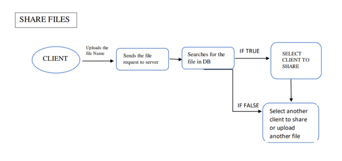

# HIGH LEVEL DESIGN (HLD)
# INTRODUCTION

High-level design provides a view of the system at an abstract level. It shows how the major 
pieces of the finished application will fit together and interact with each other.
A high-level design should also specify assumptions about the environment in which the finished 
application will run. For example, it should describe the hardware and software you will use to 
develop the application, and the hardware that will eventually run the program.

The HLD will:

• present all the design aspects and define them in detail 

• describe the user interface being implemented 

• describe the hardware and software interfaces 

• describe the performance requirements

• include design features and the architecture of the project 

• list and describe the non-functional attributes like: 

 o security 

 o reliability 

 o maintainability 

 o portability 

 o reusability 

 o application compatibility 

 o resource utilization 

 o serviceability

# SYSTEM ARCHITECTURE

A system architecture is the conceptual model that defines the structure, behavior, and more 
views of a system. An architecture description is a formal description and representation of a 
system, organized in a way that supports reasoning about the structures and behaviors of the 
system.

# DATA FLOW:
## UPLOAD:

## DOWNLOAD:

## SHARE FILES:

